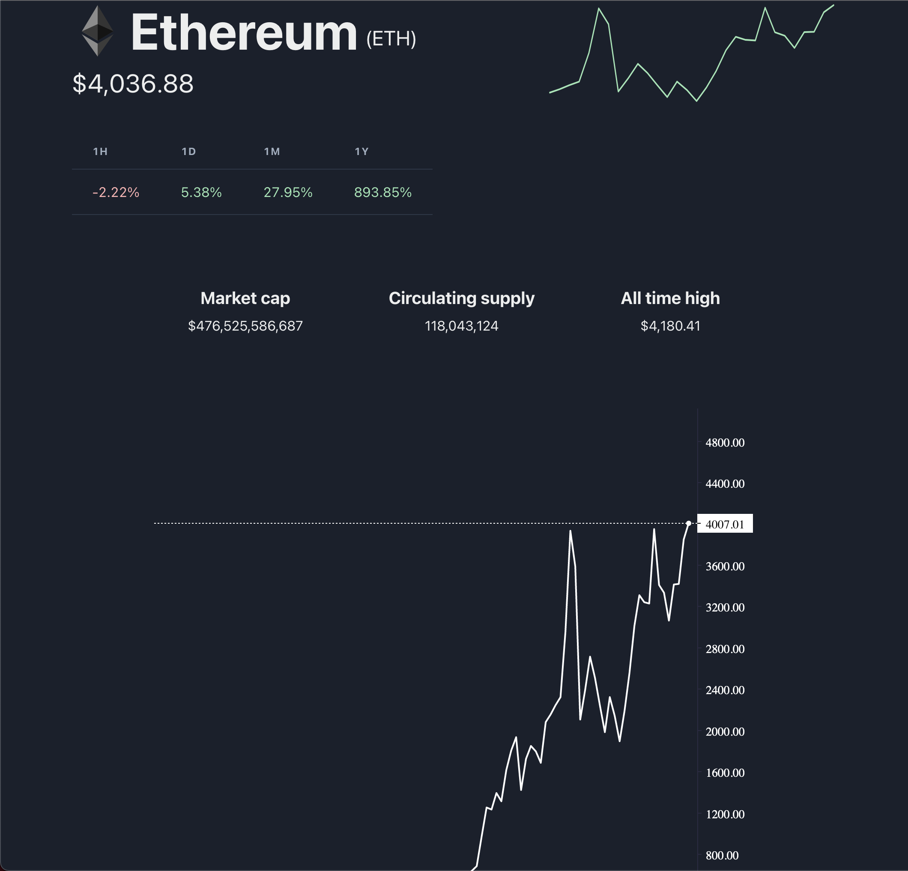

# encrypto

### Cryptocurrency portfolio tracker

 
   <code></code>
   <code></code>
 

## Getting started

1. Fork the repo. From root directory, run `cd ./server ; npm i ; nodemon ./server-js/index.js`
2. In a separate terminal, from root directory run  `cd ./client ; npm i ; npm run start`
3. With mongodb installed, run `brew services start mongodb-community`
4. You're all set, load the app in your browser on `http://localhost:3000/`
